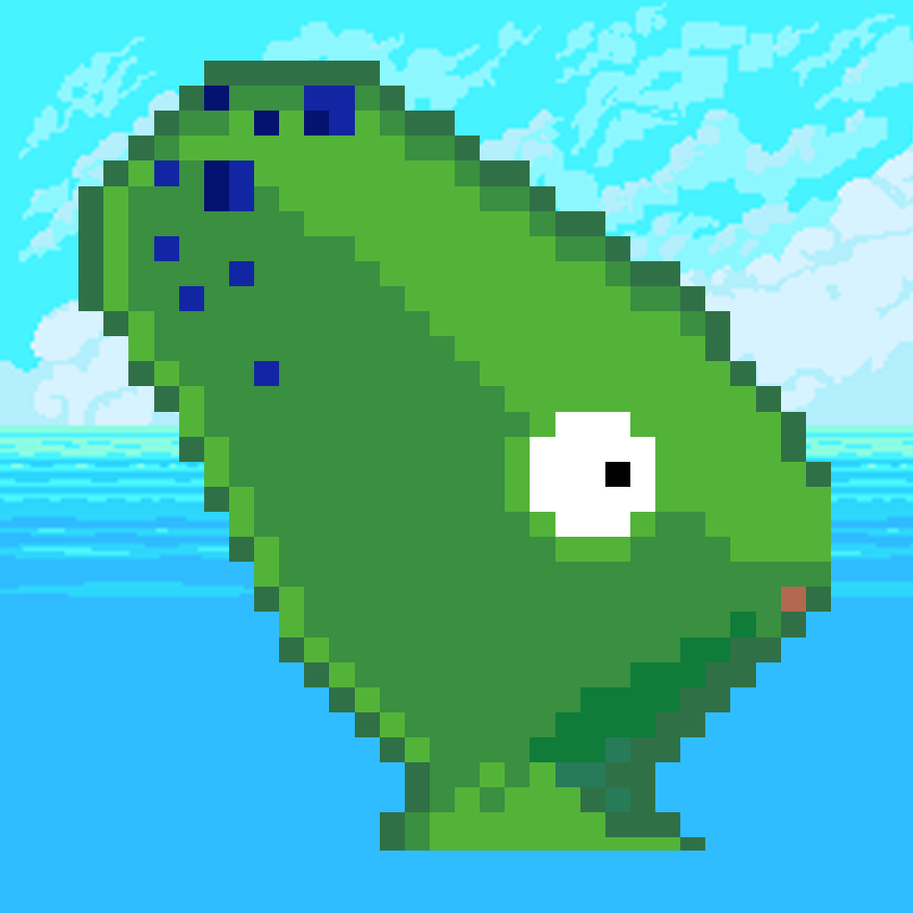

<!--
*** Many thanks for README template to Othneil Drew: https://github.com/othneildrew
*** Taken from: https://github.com/othneildrew/Best-README-Template
-->

<!-- PROJECT SHIELDS -->
<!--
*** I'm using markdown "reference style" links for readability.
*** Reference links are enclosed in brackets [ ] instead of parentheses ( ).
*** See the bottom of this document for the declaration of the reference variables
*** for contributors-url, forks-url, etc. This is an optional, concise syntax you may use.
*** https://www.markdownguide.org/basic-syntax/#reference-style-links
-->
[![Contributors][contributors-shield]][contributors-url]
[![MIT License][license-shield]][license-url]
[![LinkedIn][linkedin-shield]][linkedin-url]

<!-- PROJECT LOGO -->
 

  

  <h3 align="center">Bob the Chameleon</h3>

  

    A simple Unity 2D platform adventure game
     
  

<!-- ABOUT THE PROJECT -->
## About The Project

Bob the Chameleon has been developed for the 2018-2019 Videogame Design at Politecnico di Milano. 
The majority of graphical assets used were freely available on the [Unity Asset Store](https://assetstore.unity.com/)

### Built With
* [Unity](https://unity.com/)

<!-- CONTACT -->
## Contact

Riccardo Facchini - [LinkedIn](https://www.linkedin.com/in/riccardo-facchini-1a8206194/)

<!-- CONTRIBUTORS -->
## Contributors

* <a href="https://github.com/fatherboard">Sound designer</a>
* <a href="https://github.com/alecostella">Level designer</a>
* <a href="https://github.com/urjajhaveri">Bob's model designer</a>  
* <a href="https://github.com/michele-mevi">UI designer</a>

<!-- MARKDOWN LINKS & IMAGES -->
<!-- https://www.markdownguide.org/basic-syntax/#reference-style-links -->
[contributors-shield]: https://img.shields.io/github/contributors/Riccardo95Facchini/BobTheChameleon
[contributors-url]: https://github.com/Riccardo95Facchini/BobTheChameleon/graphs/contributors
[license-shield]: https://img.shields.io/github/license/Riccardo95Facchini/BobTheChameleon
[license-url]: https://github.com/Riccardo95Facchini/BobTheChameleon/blob/master/LICENSE
[linkedin-shield]: https://img.shields.io/badge/-LinkedIn-black.svg?style=flat-square&logo=linkedin&colorB=555
[linkedin-url]: https://linkedin.com/in/riccardo-facchini-1a8206194
